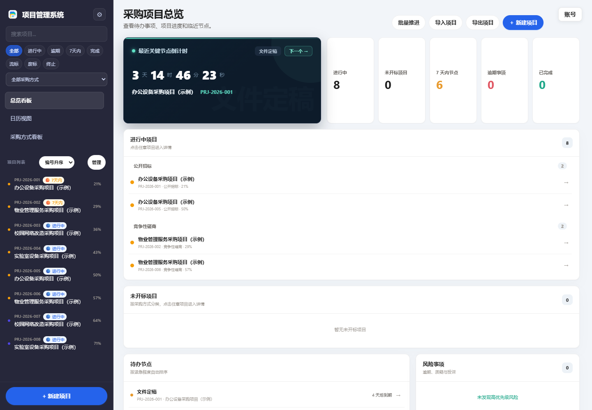
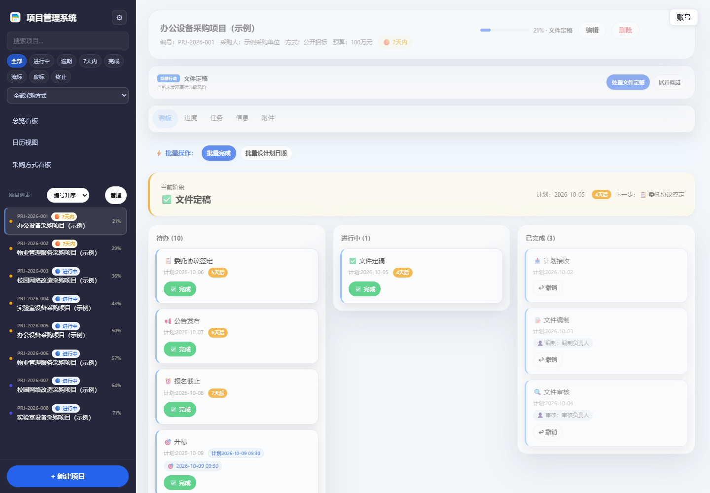
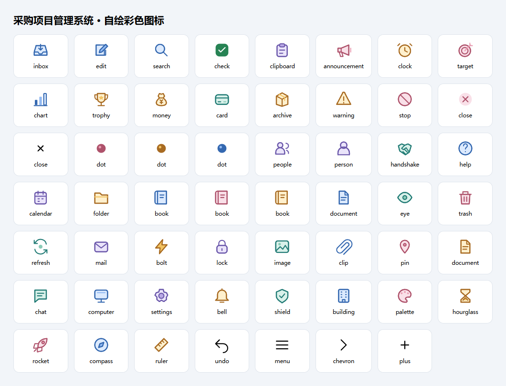

# 招标项目管理系统（采购项目管理系统）

**编制声明：本产品由 AI 开发。**

Tender Project Management System（采购项目管理系统）是面向招标采购代理机构与内部采购团队的 Windows 桌面项目管理工具，用于整理项目、标包、供应商报名、流程节点、附件与归档资料。

**源码边界：本仓库公开可编辑的前端、后端扩展和构建工具。历史核心后端目前仅以编译运行时提供，不能仅凭本仓库从零构建完整应用。** 使用和二次构建均需要公开发布的、经过脱敏的 Windows 运行时。详见[源码与运行时边界](docs/source-boundaries.md)。



## 功能

| 工作 | 支持内容 |
| --- | --- |
| 项目台账 | 项目与标包管理、采购人检索、供应商报名记录 |
| 流程管理 | 阶段模板、节点进度、公告链接、质疑投诉、中标成交、服务费与归档记录 |
| 日常查看 | 工作台、统计看板、日历与提醒 |
| 资料管理 | 附件、数据导入导出、备份与恢复 |
| 运行管理 | 设备准入、邮件配置、授权签发与验证 |

竞价相关功能用于记录外部平台、一轮报价、最低价等业务信息。系统不提供在线竞价交易、供应商实时出价或自动评标服务；实际交易与评审仍在相应业务平台完成。

常见用途包括招标采购代理项目、单位内部采购台账和服务采购项目跟踪。以网上竞价为例，流程为接收项目、编制文件、委托协议、平台发布、报名审核、报价结果登记、成交公示、服务费与通知书、资料归档。报名和报价在外部平台完成。



## 界面图标

阶段、状态、附件、设置与操作图标使用本项目自绘的彩色矢量图标，支持明暗主题。授权工具采用同风格的小图标，Logo 保持原样。



## 授权中心

授权工具 1.6 使用与系统一致的深色界面，分为签发授权、设备信息、密钥管理三页。输入框、按钮、状态与滚动条采用统一样式。自定义期限、远程机器码和备注按需展开，常用签发操作集中在一页。两个版本都使用部署者自己的密钥；具体操作见[使用说明](docs/usage.md#授权工具界面)。

## 开始使用

1. 从 [Releases](https://github.com/wangmk23/Tender-Project-Management-System/releases) 获取 Windows 发布包；没有发布资产时，请先查看[构建说明](docs/build.md)。
2. 按[使用说明](docs/usage.md)初始化自己的授权密钥，导出公钥并签发本机许可证。
3. 启动发布包中的应用，首次使用默认管理员账号 `admin`、密码 `123456`，登录后立即修改密码。
4. 建立自己的阶段模板，录入项目，并确认备份目录可以正常读写。

应用、授权工具、密钥和业务数据各有独立用途。首次运行前请阅读[使用说明](docs/usage.md)，不要将私钥、许可证、数据库、邮件密码或真实项目资料提交到公开仓库。

## 开发

前端维护目录为 `source/frontend/`，后端扩展为 `src/backend_patches/`。修改前端后执行：

```powershell
node tools/build_frontend.js --write
node tools/build_frontend.js --check
```

完整的环境要求、公开运行时校验和打包命令见[构建说明](docs/build.md)。提交问题时请提供版本、复现步骤和已脱敏的日志；具体要求见[贡献指南](.github/CONTRIBUTING.md)。

## 许可

本项目原创代码使用 [MIT License](LICENSE)。随附第三方库保留各自许可与版权，见[第三方声明](THIRD_PARTY_NOTICES.md)。MIT 许可不改变第三方代码、字体、打包运行时的许可要求。
