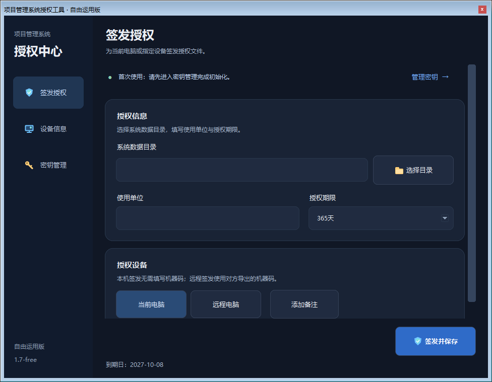
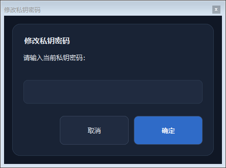

# 使用说明

## 已有授权部署升级

已有授权部署使用“保留原授权的兼容升级构建”：保留原运行时的授权校验、产品标识、公钥和数据密钥模块，使用新版本的界面与受控后端扩展。有效的原许可证沿用，原业务账号与数据保持原有配置。详见[兼容升级构建](build.md#保留已有授权的本地升级)。

公开运行时使用部署者自行生成的密钥与公开产品标识，适合初始化新部署。它与原授权部署的信任配置不同；将公开 EXE 放到旧目录并不会自动继承旧授权。

## 初始化部署

ZIP 根目录的[使用说明.txt](../使用说明.txt)可用记事本直接打开，包含首次生成密钥、签发授权、两种密码的区别、远程签发和密钥备份步骤。

解压 Windows 发布包到可写目录。完整包使用中文文件名；单独下载的 GitHub 资产保留英文文件名，两者内容一致。两个授权工具任选其一。

| 工具 | 完整包中的文件名 | 单独下载资产名 |
| --- | --- | --- |
| 系统 | 项目管理系统-V5-公开版-邮件提醒与日历修复版-v5.8.18.exe | `procurement-project-manager.exe` |
| 自由运用版 | 项目管理系统授权工具-自由运用版-公开版-邮件提醒与日历修复版-v5.8.18.exe | `license-issuer.exe` |
| 绑定磁盘版 | 项目管理系统授权工具-绑定磁盘版-公开版-邮件提醒与日历修复版-v5.8.18.exe | `license-bound.exe` |

默认数据目录就是系统 EXE 所在目录；如设置了 `PROJECT_MGR_DATA_DIR`，则使用该指定目录。授权工具初始化和签发时，目标目录应选择这个实际数据目录。首次使用授权工具时，进入“密钥管理”，选择系统实际数据目录，点击“初始化密钥”，自行设置至少 10 位的私钥密码并再次确认。工具自动生成自己的 Ed25519 签发密钥并将公钥导出到所选目录；没有默认私钥密码，与系统的 admin / 123456 登录密码不同。默认密钥目录为 `%LOCALAPPDATA%\ProcurementProjectManager\issuer`，可通过 `PROCUREMENT_ISSUER_HOME` 指定独立目录。公开包不携带签发私钥。

公钥 `license_public_key.pem` 会在初始化时自动保存到所选系统目录。回到“签发授权”，选择同一目录、填写使用单位与授权期限，选择“当前电脑”，点击“签发并保存”并输入自己设置的私钥密码。工具自动写入 `license.dat`。应用验证的是本部署的公钥，其他部署签发的许可证不能混用。具体目录与界面提示以当前发布包为准。

绑定版授权工具需在首次配置时选择实际使用的磁盘，后续按配置校验工具所在卷。不要将原部署磁盘标识或他人的绑定配置作为自己的初始化信息。迁移电脑或磁盘后，应按工具提示重新配置与签发。

首次管理员账号为 `admin`，密码为 `123456`。首次登录后立即修改密码，并按实际人员配置账号和设备准入。

## 授权工具界面

授权工具 1.8 将常用操作分为三页，两个版本共用布局：

1. 首次使用进入“密钥管理”，选择公钥导出目录，初始化自己的密钥并设置私钥密码。
2. 回到“签发授权”，选择系统实际数据目录，填写使用单位和授权期限，点击“签发并保存”。使用单位初始为空。
3. 自由运用版可切换“远程电脑”，填写对方导出的 64 位机器码；切回“当前电脑”会清除远程机器码。绑定磁盘版只签发当前电脑。
4. 自定义到期日期与备注按需展开。缩小窗口时可滚动表单，签发按钮保留在底部。
5. “设备信息”支持复制或导出设备码与机器码。复制通过页内提示反馈。

页面切换使用短暂滑入过渡。Windows 关闭动画时直接切换，也可设置环境变量 `LICENSE_REDUCED_MOTION=1`。快速连续切换不会叠加动画，填写的表单内容会保留。

密码输入、确认和提示使用同一深色弹窗，支持中文按钮、回车确认、Esc 取消。文件和目录选择使用 Windows 系统选择器。

## 日常工作

1. 设置采购流程的阶段模板与所需资料。
2. 创建采购项目与标包，维护采购人、供应商及报名记录。
3. 随业务进展维护公告链接、节点信息、质疑投诉、中标成交、服务费与归档资料。
4. 在工作台、看板和日历查看进度；配置邮件后使用相关提醒功能。
5. 定期备份，重大导入或恢复前额外保留一份可恢复的副本。

邮件设置与测试步骤见[邮件提醒说明](mail-reminders.md)，包含默认组与自定义组的区别、总开关、首次事件基线及失败重试。

竞价页面记录外部平台及报价结果等信息，不能替代外部平台的报名、报价、交易、评审或公告发布。

## 数据与迁移

业务数据库、附件、备份、邮件凭据、许可证、设备准入信息与签发密钥属于本部署。保存应用备份的同时，单独妥善保存签发密钥与密码；备份业务数据不等于备份授权密钥。

迁移或升级前备份现有资料，在副本中确认新版本能读取数据和附件。不要把 Git 仓库当作业务备份，也不要上传真实数据来复现问题。提交问题时使用人工构造的项目和附件，并删除日志中的人员、组织、邮件、路径及设备信息。
